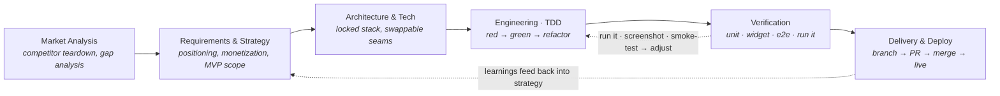

# Designing an Automated Product Development Pipeline

> **One-line thesis:** I built a *repeatable system* that takes a product from
> **market analysis → strategy → architecture → shipped, tested software**, with
> an AI coding agent doing the execution and me acting as the
> architect/PM/reviewer at every gate. **Super Sudoku** (live, free, test-driven)
> is the proof case.

*Goal of this doc: show the end-to-end approach, the engineering judgment, and
the outcomes — not a tool demo.*

---

## 1. TL;DR

Most products need a PM, a designer, an architect, several engineers, QA, and
DevOps. I wanted to compress that into **one disciplined operator + an AI agent**,
*without* lowering the engineering bar. So I designed a pipeline with explicit
**stages, artifacts, and quality gates** — the same way you'd design a CI/CD
system, but for the *whole* product lifecycle.

The interesting part isn't "an AI wrote code." It's the **system around it**:
how requirements become locked decisions, how every change is test-driven and
verified, and how I kept a fast agent from shipping plausible-but-wrong work.

---

## 2. The problem

- Going from "idea" to "shipped product" has ~7 role-shaped steps; doing them
  ad-hoc produces inconsistent quality and lost context.
- An AI agent is fast but will confidently ship subtly-broken work if you let it.
- I needed an approach that is **repeatable** (works for the next product),
  **rigorous** (TDD, real verification), and **cheap** (₹0 infra).

**Success criteria:** a live, genuinely-good product; every increment tested;
every decision captured; and a pipeline I can re-run for a different product.

---

## 3. The pipeline (end-to-end)



<details><summary>Plain-text version (if the diagram doesn't render)</summary>

```
Market Analysis → Requirements & Strategy → Architecture & Tech
   → Engineering (TDD) → Verification → Delivery & Deploy
        ↑__ verify loop (run/screenshot/smoke-test) __|
   |__ learnings feed back into strategy __________________|
```

</details>

Each stage produces a durable **artifact** that the next stage consumes:

| Stage | Activity | Artifact produced |
|---|---|---|
| **0. Market analysis** | Analyze top apps in the category; find what they do well and where they're weak | A positioning gap ("Cognitive Gym": mass-market + a real learning ramp) |
| **1. Requirements & strategy** | Turn the gap into product decisions: positioning, monetization, MVP scope | `PLAN.md` (locked decisions: free Daily funnel + a single ₹9.9 unlock, no ads) |
| **2. Architecture** | Choose the stack and the principles; design **seams** so risky parts can change later | `ARCHITECTURE.md` (Riverpod/Drift/go_router; domain is pure; Firebase behind interfaces) |
| **3. Engineering (TDD)** | Build in small increments, tests first | Code + tests, one feature per increment |
| **4. Verification** | Unit → widget → e2e → **actually run it** | Green suite + screenshots + a live smoke test |
| **5. Delivery** | Branch → PR → squash-merge → deploy | Merged PRs; a live URL |
| **∞. Memory** | Persist decisions/feedback so context never resets | A durable decision log the pipeline reads each session |

The **feedback loops** are the point: I don't trust "tests pass." I run the
real app, screenshot it, and smoke-test the deployed site (see §5).

---

## 4. Engineering architecture (built to change)

The product is a Flutter app (Android/iOS/Web). The decisions that matter:

- **Pure domain core.** The Sudoku engine + game rules are plain Dart with zero
  framework imports — the durable, fully-unit-testable asset. UI and backend sit
  *on top* of it.
- **Layered, feature-first.** `domain → data → application(state) → UI`,
  dependencies pointing one way. Each feature owns its slice.
- **Swappable seams (the key bet).** Risky/expensive concerns hide behind
  interfaces: `AuthRepository`, `SyncService`, `LeaderboardRepository`. There's a
  **local implementation** and a **Firebase implementation**; the app picks one
  at runtime and **falls back gracefully** if the backend is down. This let me
  build and ship *before* committing to Firebase, and pivot later with zero churn.
- **Offline-first.** Local storage (SQLite/Drift, incl. a WASM build for web) is
  authoritative; the network is an enhancement. Fonts are bundled too — the app
  works in airplane mode.
- **Reactive state.** Derived data (stats, rating) is computed from live data
  streams, so the UI can never show stale numbers — a class of bug designed out.

> **Why it matters:** the architecture is designed for *change under uncertainty*,
> not for a fixed spec. That's what made the later pivots cheap.

---

## 5. Quality strategy: automation *without* losing rigor

This is where I kept the agent honest. Four layers, cheapest first:

1. **Domain unit tests** — the engine, rating math, ranking logic (pure, fast).
2. **Application tests** — controllers via dependency-injected fakes.
3. **Widget tests** — screens render and react correctly.
4. **End-to-end + "actually run it"** — drive the real app; capture **screenshots**;
   run a **live smoke test** against the deployed site with a real browser.

**TDD is the default** (tests precede UI/feature code). Result so far: **137
tests, analysis clean, on every merge.**

**The story that matters:** the live smoke test on the deployed web app found a
bug the entire green test suite missed — Firebase failed to initialize in
production (a stale web plugin registrant), and a defensive `try/catch` had
*silently* hidden it behind the offline fallback. I diagnosed it (browser
console + network probe), fixed it (clean rebuild + redeploy), and **re-verified
in production**.

> **Why it matters:** "tests are green" is necessary, not sufficient. I verify the
> real artifact in the real environment — and I treat a swallowed error as a bug,
> not a feature.

---

## 6. SDLC automation: how work actually ships

Every increment follows the same loop, so quality is structural, not heroic:

```
write failing test → implement → analyze + test → run/screenshot →
  feature branch → PR (with rationale) → squash-merge → (deploy)
```

- **One concern per PR**, descriptive history (33 PRs and counting), no direct
  commits to `main`.
- **Decisions + feedback persisted** to a memory log the pipeline reloads each
  session — so context (why we chose X, what the user corrected) never resets.
- **Deployment is scripted and free:** `flutter build web && firebase deploy`
  → a live, shareable URL on Firebase's free tier.

---

## 7. Decisions & trade-offs

Real calls I made, and the reasoning behind them:

| Decision | Trade-off I made | Why |
|---|---|---|
| **Defer Firebase**, build local-first behind interfaces | Slower "cloud demo" | Ship value early; de-risk; pivot cheaply later |
| **Free (Spark) plan** when Cloud Functions (Blaze) weren't an option | Leaderboard rating is *client-trusted* (spoofable) | Zero cost now; full server-side anti-cheat kept dormant behind a **one-line flag** for a later upgrade |
| **Server-trusted anti-cheat** built but **not deployed** | Dead-ish code today | Designed + tested (server math parity-tested against the client) so flipping to Blaze is zero-rewrite |
| **Manual Riverpod providers** instead of codegen | More boilerplate | The codegen package couldn't co-resolve; manual is a drop-in to migrate later |
| **Generate the app icon in code** | Not a designer's icon | Reproducible, on-brand, no external dependency |

The throughline: **make the reversible decision now, keep the expensive one
optional.** Flags and seams over big rewrites.

---

## 8. Results (the proof)

- **Live, playable, free:** `https://super-sudoku-99labs.web.app`
- **Scope shipped:** full game + daily challenge, a Duolingo-style **learning
  path** (per-technique guided lessons powered by the engine), persistence
  (incl. web), accounts, **puzzle rating + tiers + a live leaderboard**, a
  branded launch identity.
- **Quality:** 137 automated tests, clean static analysis, layered verification,
  a production bug caught *and fixed* via live smoke testing.
- **Cost:** **₹0** infrastructure (Firebase free tier + Hosting).
- **Throughput:** ~33 reviewed PRs across the full lifecycle, each test-backed.

---

## 9. How it generalizes

The pipeline is **product-agnostic** — the stages, gates, and principles don't
depend on Sudoku. I'm reusing the exact same flow for a sibling product
(a teaching-first chess app), starting from its own market analysis. The
artifacts (PLAN/ARCHITECTURE/DESIGN + memory) are the reusable "operating
system" for building the next thing.

---

## 10. Limitations & what I'd do next (honest)

- **Anti-cheat** is client-trusted on the free tier; the server-authoritative
  path needs a paid plan to deploy. *Next:* server-issued puzzles + solution
  verification.
- **No real-device pass yet** — verified on web + emulated; hardware feel/timing
  is the remaining "certify it" step.
- **AI verification gap** — automation can produce confident-but-wrong work; my
  mitigation is the layered + live verification above, but it needs constant
  vigilance. *Next:* fold the live smoke test into the deploy script as a gate.
- **Store launch** (paywall, listings) needs paid developer accounts — a
  business gate, not an engineering one.

---

## Appendix — stack at a glance

Flutter · Dart (pure-domain engine) · Riverpod (state) · Drift/SQLite + WASM
(offline-first storage) · go_router (deep links) · Firebase Auth + Firestore +
Hosting (free tier) · Cloud Functions/TypeScript (anti-cheat, dormant) ·
GitHub (branch-per-increment + PRs) · TDD throughout.

**In one sentence:** *a test-driven, seam-based product pipeline — market
analysis to live deploy — that an AI agent executes under human review, verified
in production, not just in CI.*
